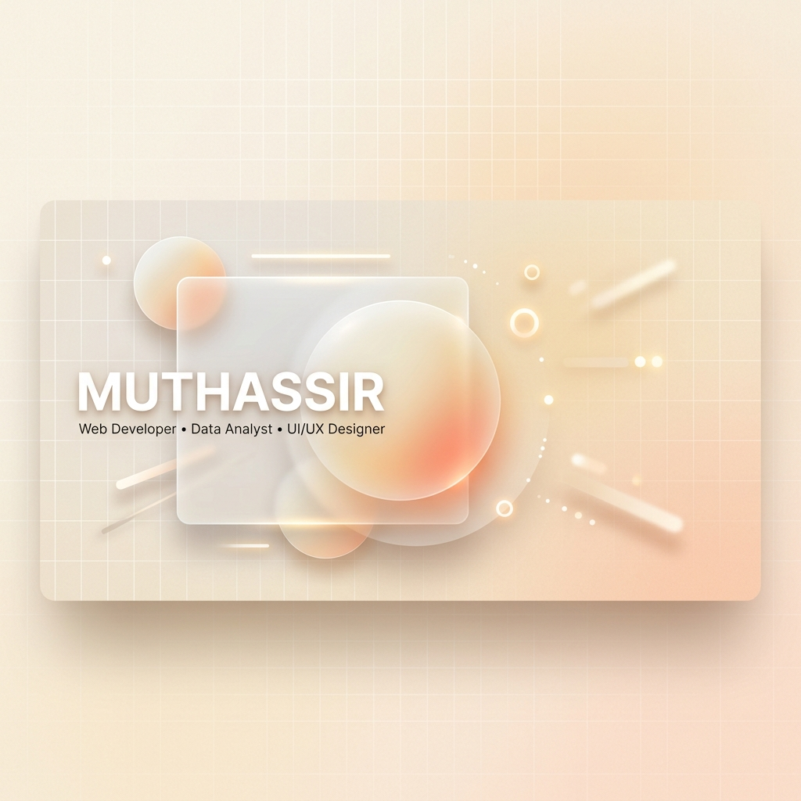

  

<h1 align="center">Hey there, I'm Muthassir! 👋</h1>

  <picture>
    <source media="(prefers-color-scheme: dark)" srcset="https://readme-typing-svg.demolab.com?font=Outfit&size=24&pause=1000&color=F5EBE6&center=true&vCenter=true&width=500&lines=Web+Developer;Data+Analyst;UI%2FUX+Designer;3rd+Year+CS+Student">
    <source media="(prefers-color-scheme: light)" srcset="https://readme-typing-svg.demolab.com?font=Outfit&size=24&pause=1000&color=4A3F35&center=true&vCenter=true&width=500&lines=Web+Developer;Data+Analyst;UI%2FUX+Designer;3rd+Year+CS+Student">
    
  </picture>

  🚀 Currently pursuing my <strong>3rd Year Undergraduate Degree in Computer Science</strong>. I specialize in building sleek, interactive web applications, crafting intuitive user experiences, and transforming raw data into meaningful insights.

### 🛠️ Languages & Tools

A curated selection of technologies and libraries I work with, styled in a cohesive warm pastel palette:

  
  
  
  
  
  
  
  
  
  
  

### 📈 GitHub Stats

These panels dynamically update and adapt their theme depending on whether you are viewing GitHub in **Light Mode** or **Dark Mode**:

  <picture>
    <source media="(prefers-color-scheme: dark)" srcset="https://github-readme-stats.vercel.app/api?username=YOUR_USERNAME&show_icons=true&bg_color=1E1E24&title_color=F5EBE6&text_color=D4C5B9&icon_color=E8A7A1&border_color=2F2F38&hide_border=false">
    <source media="(prefers-color-scheme: light)" srcset="https://github-readme-stats.vercel.app/api?username=YOUR_USERNAME&show_icons=true&bg_color=FDFAF6&title_color=4A3F35&text_color=5C5043&icon_color=D4A373&border_color=E8E1D5&hide_border=false">
    
  </picture>
  <picture>
    <source media="(prefers-color-scheme: dark)" srcset="https://github-readme-stats.vercel.app/api/top-langs/?username=YOUR_USERNAME&layout=compact&bg_color=1E1E24&title_color=F5EBE6&text_color=D4C5B9&icon_color=E8A7A1&border_color=2F2F38&hide_border=false">
    <source media="(prefers-color-scheme: light)" srcset="https://github-readme-stats.vercel.app/api/top-langs/?username=YOUR_USERNAME&layout=compact&bg_color=FDFAF6&title_color=4A3F35&text_color=5C5043&icon_color=D4A373&border_color=E8E1D5&hide_border=false">
    
  </picture>

  <picture>
    <source media="(prefers-color-scheme: dark)" srcset="https://github-readme-streak-stats.herokuapp.com/?user=YOUR_USERNAME&background=1E1E24&border=2F2F38&stroke=2F2F38&ring=E8A7A1&fire=E8A7A1&currStreakNum=F5EBE6&currStreakLabel=D4C5B9&sideNums=F5EBE6&sideLabels=D4C5B9&dates=A89F91">
    <source media="(prefers-color-scheme: light)" srcset="https://github-readme-streak-stats.herokuapp.com/?user=YOUR_USERNAME&background=FDFAF6&border=E8E1D5&stroke=E8E1D5&ring=D4A373&fire=D4A373&currStreakNum=4A3F35&currStreakLabel=5C5043&sideNums=4A3F35&sideLabels=5C5043&dates=8D99AE">
    
  </picture>

### 🎯 Hobbies & Interests

Beyond programming and database analysis, I love:
* ♟️ **Chess** — Strategizing and analyzing moves.
* 🏏 **Cricket** & ⚽ **Football** — Staying active and playing team sports.
* 🎵 **Listening to Music** — Exploring new genres and focusing.

---

### 💬 Connect with Me!

Feel free to reach out to collaborate on exciting projects or just chat about tech:

  
  
  

---

  <i>"Simplicity is the ultimate sophistication."</i> — <b>Leonardo da Vinci</b>

